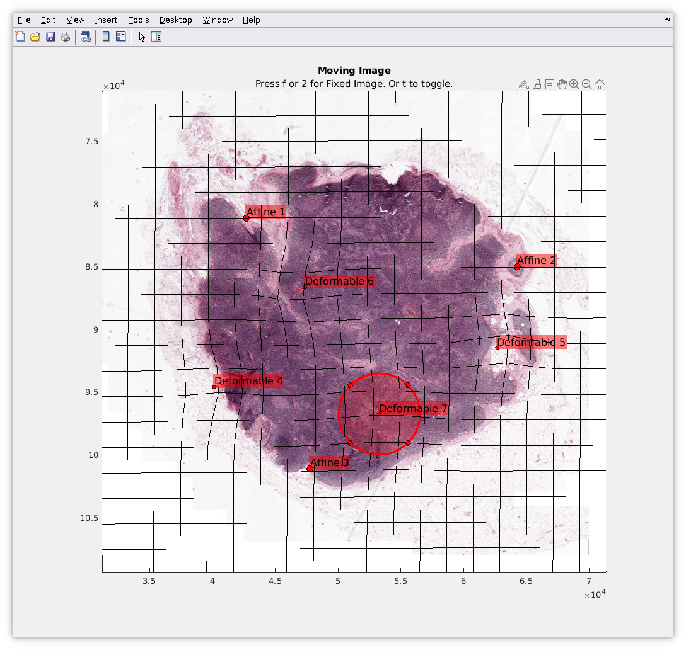

# Nonrigid Whole Slide Image Registration using Control Points

  

A MATLAB&reg; Graphical User Interface for registering large whole slide images (WSI) using manually placed control points. 

### MathWorks Products (https://www.mathworks.com)

Requires MATLAB&reg; release R2023b or newer
- [Image Processing Toolbox &trade;](https://www.mathworks.com/products/image.html)

## Getting Started 
The [blockedImage](https://www.mathworks.com/help/images/large-image-files.html) object can be used to handle large (Multi GB, larger than available RAM) images like WSI data. It can efficiently stream data in smaller blocks which will fit in RAM, and associated visualization functions will also selectively load appropriate resolutions of the data. WSI is typically stored in multi-resolution TIFF files that can be loaded in directly using the blockedImage constructor. 
For example, if the following two files existed, they would be loaded using:

    bmov = blockedImage('movingWSI.tif')
    bfix = blockedImage('fixedWSI.tif')

Launch the GUI 

    h = DeformableRegistrationUI(bmov,bfix) 

The GUI enables registering two 2D blockedImages using manual control points. First three control points are registered using an affine transform, and all subsequent points perform non-rigid (deformable) registration.

**Recommended workflow:**
1. Ensure both inputs have sufficient levels to enable quick
  viewing. Ideally, the coarsest level is at most the size of the
  screen. Use [makeMultiLevel2D](https://www.mathworks.com/help/images/ref/blockedimage.makemultilevel2d.html) to add levels if they don't already
  exist.
2. Use keyboard shortcuts to toggle (t key) between the moving (1
  or m key) or fixed (2 or f key) image.
3. Use mouse scroll to zoom, click and drag to pan.
4. Toggle between the images and identify a prominent feature that
  is clearly visible in both images. Double click on this feature
  to place a point. Do this on both images. The display will
  update to show the registered image based on this point.
5. Repeat the previous step two more times. On each addition, the
  intermediate registered moving image will be shown.
6. This registration happens on the fly, only for the part of the
  image being displayed. So when zoomed in, only the region in
  view is warped. 
7. Skip to export (11) if only rigid, affine transformation is required.
8. To add non-rigid (deformable) control points, repeat the
  process of placing corresponding points. When the registration
  transitions to the non-rigid mode, a deformed grid is shown as a
  visual indication for the displacement/deformation field. Update
  h.GridSize and h.GridColor to change appearance in the next
  refresh.
9. Click on a deformable control point in the moving image to bring
  up the "impact circle". This circle controls the region around
  this point where the corresponding displacement is distributed.
  Click and drag the circle to change the radius. 
10. Only moving deformable points can be deleted by selecting the
  point and hitting the 'delete' key. The corresponding fixed
  point is also deleted. Points can be dragged to re-position
  anytime.
11. To export the final result, call write(h.BMoving,...). See
  [blockedImage/write](https://www.mathworks.com/help/images/ref/blockedimage.write.html) for more details.

See also: [blockedImage](https://www.mathworks.com/help/images/large-image-files.html), [makeMultiLevel2D](https://www.mathworks.com/help/images/ref/blockedimage.makemultilevel2d.html) 
    

## License
The license is available in the License.txt file in this GitHub repository.

## Community Support
[MATLAB Central](https://www.mathworks.com/matlabcentral)

Copyright 2023 The MathWorks, Inc.

